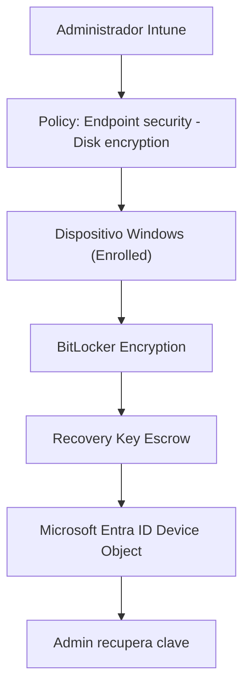

## Objetivo

Implementar BitLocker en Windows con Microsoft Intune (Endpoint security) y validar:

- Cifrado activo en el equipo
- Rotación/registro de claves
- **Recuperación de la clave** desde **Microsoft Entra ID**
- Recomendaciones de seguridad y errores comunes

---

## Alcance

Incluye:
- Política de BitLocker vía Intune
- Validación local (Windows)
- Validación en portal (Entra ID)
- Troubleshooting frecuente

No incluye:
- Configuración avanzada con MBAM (legado)
- Escenarios complejos con coadministración SCCM (aunque dejo notas)

---

## Arquitectura / Flujo




## Requisitos Técnicos

Windows 10/11 Pro/Enterprise/Education
- Dispositivo inscrito en Intune
- Recomendado: Entra Joined (o Hybrid Joined si aplica)
- TPM disponible (recomendado para mejor experiencia)
- Roles / permisos
- Permiso para administrar políticas en Intune
- Permiso para ver dispositivos en Entra ID (para recuperar claves)
- Consideraciones previas
- Define si vas a cifrar:
  - Solo SO drive (más común)
  - SO + unidades fijas (más restrictivo)
  - Unidades removibles (BitLocker To Go)


---

## Paso a paso
### Paso 1 — Verifica estado del dispositivo (rápido)
 En el equipo (PowerShell como admin):
```powershel


# Estado de BitLocker
manage-bde -status

# Estado TPM (si aplica)
Get-Tpm


Esperado:

Si aún no está cifrado, verás "Conversion Status: Fully Decrypted"

TPM listo (TpmReady : True) ayuda, pero no siempre es obligatorio según tu política


```

### Paso 2 — Crear política de cifrado en Intune (Endpoint security)

Entra a Intune admin center

Ve a: Endpoint security → Disk encryption

Crea una directiva nueva (Windows)

Config recomendada (base segura, ajustable a tu entorno):

Habilitar BitLocker para unidad del sistema operativo

Requerir método de protección con TPM (preferido)

Permitir recuperación con clave de recuperación

Guardar/escrow de clave de recuperación en Entra ID (por defecto con Intune/Entra Joined)

Nota: El portal y nombres exactos pueden variar ligeramente por actualización UI, pero la ruta “Endpoint security → Disk encryption” es la referencia.

Asigna la política a un grupo de dispositivos (piloto primero).

### Paso 3 — Forzar sincronización (piloto)

En el equipo:

Settings → Accounts → Access work or school → Info → Sync
o desde Company Portal:

Sync

Espera la aplicación (usualmente minutos, pero depende del ciclo).

### Paso 4 — Validar cifrado en el equipo
manage-bde -status C:


Esperado:

Conversion Status: Fully Encrypted

Protection Status: Protection On

Si está “Encrypting”, espera a que termine.

### Paso 5 — Validar que la clave quedó registrada (Entra ID)

En el portal de Microsoft Entra admin center:

Devices

Busca el dispositivo

Dentro del dispositivo, ve a BitLocker keys (o “Recovery keys” según UI)

Debes poder ver:

ID de clave

Información asociada al dispositivo

Si no aparece: revisa “Errores comunes” más abajo.

Validación (checklist de éxito)
- En el dispositivo

```powershel

 manage-bde -status muestra Fully Encrypted
 BitLocker Protection On

```
En Intune

Dispositivo aparece “Compliant” (si tu compliance policy incluye cifrado)

La política de Disk encryption aparece “Succeeded” o aplicada

En Entra ID

El dispositivo muestra BitLocker keys visibles para admin

### Errores comunes (y cómo resolverlos)
Síntoma	Causa probable	Solución recomendada
No cifra	Política no llegó / conflicto	Forzar Sync, revisar asignación a grupo, validar que no haya otra política BitLocker aplicándose
Cifra pero no hay clave en Entra ID	El dispositivo no está Entra Joined / permisos / retraso	Verifica estado join, espera propagación, revisa que la política permita escrow y que el dispositivo esté bien registrado
Sin TPM / fallos TPM	BIOS/UEFI TPM deshabilitado o no listo	Habilitar TPM en BIOS/UEFI, reiniciar, validar Get-Tpm
“Access denied” al ver claves	Falta de permisos RBAC	Ajusta roles en Entra/Intune para recuperación de claves
CSS/JS del blog ok pero el post no aparece	draft: true	Cambia a draft: false

### Recomendaciones de seguridad (hardening)

Piloto primero: aplica a un grupo pequeño antes de masificar

Evita configuraciones que permitan “sin TPM” salvo casos justificados (mejor UX + seguridad con TPM)

Define política de rotación/gestión de claves (operación)

Alinea con compliance:

Si manejas datos regulados, exige cifrado como requisito de cumplimiento

Documenta procedimiento de recuperación para Service Desk (pero no publiques claves ni ejemplos reales)

### Rollback (reversión)

Si necesitas detener el cifrado (raro en producción):

Quita la asignación de la política (o asigna una política distinta)

Para descifrar manualmente (solo en laboratorio):

manage-bde -off C:


En producción, define un proceso formal de cambio/riesgo antes de descifrar.

### Operación y monitoreo

 Usa reportes de Intune (Endpoint security / Device status)
 Valida eventos en el dispositivo (Event Viewer) si hay fallos de cifrado
 Establece un runbook de:
 Alta de dispositivos
 Verificación de cifrado
 Recuperación de claves
 Rotación/gestión

### Referencias oficiales

Microsoft Intune - Disk encryption / BitLocker (documentación):
https://learn.microsoft.com/en-us/mem/intune/protect/encrypt-devices

Microsoft Entra - Devices (administración de dispositivos):
https://learn.microsoft.com/en-us/entra/identity/devices/

### Anexo — Comandos útiles
Estado BitLocker
manage-bde -status

Información TPM
Get-Tpm

Ver protectores BitLocker (detalle)
manage-bde -protectors -get C:
