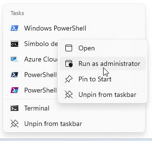
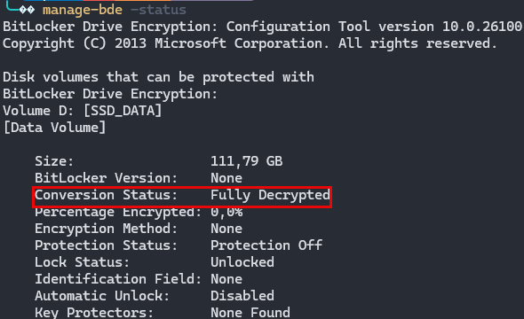
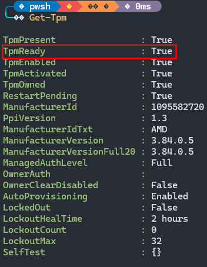

> **Nivel:** Intermedio · **Tiempo estimado:** 45–60 min · **Última validación:** Enero 2026

## Objetivo

Implementar BitLocker en dispositivos Windows administrados con Microsoft Intune
(Endpoint Security) y validar el ciclo completo:

- Cifrado silencioso activo en el equipo
- Registro automático de claves de recuperación (escrow)
- Recuperación de la clave desde Microsoft Entra ID
- Troubleshooting con logs y eventos de Windows

## Alcance

**Incluye:**

- Política de BitLocker vía Intune (Endpoint Security → Disk encryption)
- Cifrado silencioso (sin intervención del usuario)
- Validación local en Windows
- Validación en portal (Entra ID)
- Script para forzar backup de recovery key
- Troubleshooting con Event Viewer y comandos

**No incluye:**

- MBAM (Microsoft BitLocker Administration and Monitoring, legado)
- Escenarios de coadministración con SCCM/ConfigMgr
- BitLocker To Go (unidades removibles)

## Arquitectura del Flujo

<pre class="mermaid">
flowchart TD
    A["Administrador Intune"] --> B["Endpoint Security\nDisk Encryption Policy"]
    B -->|"Asignar a grupo"| C["Dispositivo Windows\n(Entra Joined o Hybrid)"]
    C --> D["BitLocker Silent\nEncryption"]
    D --> E["Recovery Key\nEscrow automático"]
    E --> F["Microsoft Entra ID\nDevice Object"]
    F --> G["Admin: Recuperar\nclave en portal"]

    style A fill:#0078d4,color:#fff
    style F fill:#0078d4,color:#fff
</pre>

## Requisitos

### Dispositivo

| Requisito | Detalle |
|---|---|
| Sistema operativo | Windows 10/11 Pro, Enterprise o Education |
| Enrolamiento | Dispositivo inscrito en Intune |
| Join type | Entra Joined (recomendado) o Hybrid Entra Joined |
| TPM | Chip TPM 2.0 disponible y habilitado (recomendado) |
| BIOS/UEFI | Secure Boot habilitado (recomendado) |

### Roles y permisos

**Roles de Entra ID** (cualquiera de estos):

- Intune Administrator
- Security Administrator
- Global Administrator (evitar en producción)

**Roles de Intune** (para operación día a día):

- Endpoint Security Manager — crear y asignar políticas
- Help Desk Operator — ver estado de dispositivos y recuperar claves

### Decisiones previas

Antes de implementar, define el alcance del cifrado:

<pre class="mermaid">
flowchart LR
    A["¿Qué unidades cifrar?"] --> B["Solo SO (C:)\n— Más común"]
    A --> C["SO + Fijas\n— Más restrictivo"]
    A --> D["Removibles\n— BitLocker To Go\n(fuera de alcance)"]

    style B fill:#107c10,color:#fff
</pre>

## Paso a Paso

### Paso 1 — Verificar estado del dispositivo

Abre PowerShell como administrador en el equipo de prueba:



Verifica el estado actual de BitLocker:
```powershell
# Estado de BitLocker en todas las unidades
manage-bde -status
```

**Esperado si no está cifrado:** `Conversion Status: Fully Decrypted`



Verifica disponibilidad del TPM:
```powershell
# Estado del módulo TPM
Get-Tpm
```

**Esperado:** `TpmReady: True` y `TpmPresent: True`



> **Nota:** TPM no siempre es obligatorio — depende de la política. Sin TPM, BitLocker
> puede usar contraseña de arranque, pero la experiencia de usuario es peor.

### Paso 2 — Crear política de cifrado en Intune

1. Ingresa a [Microsoft Intune admin center](https://intune.microsoft.com)
2. Navega a: **Endpoint security → Disk encryption**
3. Selecciona **Create policy**
4. Plataforma: **Windows 10 and later**
5. Perfil: **BitLocker**

Configuración base recomendada:

| Setting | Valor recomendado | Notas |
|---|---|---|
| Require device encryption | Yes | Habilita cifrado |
| Allow standard users to enable encryption | Yes | Permite cifrado silencioso |
| Configure encryption method (OS drive) | XTS-AES 256-bit | Máxima seguridad |
| OS drive recovery | Enable | Permite recuperación |
| Save BitLocker recovery info to Entra ID | Yes | Escrow automático de claves |
| Configure pre-boot recovery message | Default recovery message | O personalizar con instrucciones de Service Desk |
| Startup TPM | Require TPM | Para la mejor experiencia |

6. En **Assignments**, asigna a un **grupo de dispositivos piloto** (nunca directamente a todos)

> **Buena práctica:** Crea un grupo dinámico en Entra ID con 3–5 dispositivos de prueba
> para validar antes de masificar.

### Paso 3 — Forzar sincronización en el dispositivo

En el equipo del piloto:

**Opción A** — Desde Settings:

Settings → Accounts → Access work or school → [Tu cuenta] → Info → Sync

**Opción B** — Desde Company Portal:
Company Portal → Settings → Sync

**Opción C** — Desde PowerShell (forzar check-in IME):
```powershell
# Forzar sincronización con Intune
Get-ScheduledTask | Where-Object {$_.TaskName -like "*IntuneManagementExtension*"} | Start-ScheduledTask

# Alternativamente, reiniciar el servicio IME
Restart-Service -Name IntuneManagementExtension -Force
```

Espera entre 5–15 minutos para que la política se aplique.

### Paso 4 — Validar cifrado en el equipo
```powershell
# Verificar estado después de la sincronización
manage-bde -status C:
```

**Resultado esperado:**
Conversion Status:    Fully Encrypted
Encryption Method:    XTS-AES 256
Protection Status:    Protection On
Key Protectors:
TPM
Numerical Password

Si muestra `Encrypting...`, espera a que termine. Puedes monitorear el progreso:
```powershell
# Monitorear progreso de cifrado (se actualiza cada 10 seg)
while ((manage-bde -status C: | Select-String "Percentage Encrypted") -notmatch "100") {
    manage-bde -status C: | Select-String "Percentage Encrypted"
    Start-Sleep -Seconds 10
}
Write-Host "Cifrado completado" -ForegroundColor Green
```

### Paso 5 — Verificar protectores y clave de recuperación
```powershell
# Ver protectores BitLocker del drive C:
manage-bde -protectors -get C:

# Output esperado:
# TPM:
#   ID: {XXXXXXXX-XXXX-XXXX-XXXX-XXXXXXXXXXXX}
# Numerical Password:
#   ID: {YYYYYYYY-YYYY-YYYY-YYYY-YYYYYYYYYYYY}
#   Password: 123456-789012-345678-901234-567890-123456-789012-345678
```

### Paso 6 — Validar clave en Microsoft Entra ID

1. Ingresa a [Microsoft Entra admin center](https://entra.microsoft.com)
2. Navega a: **Identity → Devices → All devices**
3. Busca el dispositivo por nombre
4. Selecciona el dispositivo → **BitLocker keys** (o "Recovery keys")

**Debes ver:**

- Key ID (identificador del protector)
- Recovery key (clave numérica de 48 dígitos)
- Fecha de creación
- Drive asociado

> Si la clave no aparece, consulta la sección de Troubleshooting más abajo.

### Paso 7 — Forzar backup de clave (si no se registró)

Si la clave no apareció automáticamente en Entra ID:
```powershell
# Obtener el ID del protector de tipo RecoveryPassword
$protector = (manage-bde -protectors -get C: -Type RecoveryPassword).Trim()

# Extraer el ID (formato GUID entre llaves)
$keyId = [regex]::Match($protector, '\{[A-F0-9-]+\}').Value

# Forzar backup a Entra ID
BackupToAAD-BitLockerKeyProtector -MountPoint "C:" -KeyProtectorId $keyId

# Verificar
Write-Host "Backup de clave enviado a Entra ID para protector: $keyId"
```

## Validación — Checklist de Éxito

### En el dispositivo
```powershell
# ✅ Cifrado completo
manage-bde -status C: | Select-String "Conversion Status"
# Esperado: Fully Encrypted

# ✅ Protección activa
manage-bde -status C: | Select-String "Protection Status"
# Esperado: Protection On

# ✅ Protectores presentes
manage-bde -protectors -get C:
# Esperado: TPM + Numerical Password
```

### En Intune

- Dispositivo aparece como **Compliant** (si tu compliance policy requiere cifrado)
- La política de Disk encryption muestra estado **Succeeded** en el dispositivo
- En **Endpoint security → Disk encryption → [Tu política] → Device status**

### En Entra ID

- El dispositivo muestra **BitLocker keys** visibles en el portal
- Key ID coincide con el protector local (`manage-bde -protectors -get C:`)

## Troubleshooting

### Errores Comunes

| Síntoma | Causa probable | Solución |
|---|---|---|
| No cifra después de sync | Política no llegó o conflicto con otra | Forzar sync, revisar asignación a grupo. Verificar que no haya otra política BitLocker en conflicto (Intune → Device config vs Endpoint Security) |
| Cifra pero clave no aparece en Entra ID | Dispositivo no es Entra Joined, o retraso en propagación | Verificar `dsregcmd /status` → AzureAdJoined: YES. Ejecutar `BackupToAAD-BitLockerKeyProtector`. Esperar hasta 1h |
| Error TPM no disponible | TPM deshabilitado en BIOS/UEFI | Habilitar TPM 2.0 en BIOS/UEFI. Reiniciar. Verificar con `Get-Tpm` |
| "Access denied" al ver claves en Entra | Falta de permisos RBAC | Asignar rol Cloud Device Administrator o Helpdesk Administrator |
| Cifrado se detiene / revierte | Disco GPT requerido, no MBR | Verificar `Get-Disk \| Select PartitionStyle`. Convertir a GPT si es necesario |
| Error 65000 en Event Viewer | Conflicto de política (GPO + Intune) | Verificar que no hay GPO de dominio aplicando BitLocker simultáneamente |

### Logs y Eventos para Diagnóstico

El Event Viewer de Windows es la herramienta principal para diagnosticar fallos de BitLocker:
```powershell
# Ver eventos recientes de BitLocker-API (últimas 24h)
Get-WinEvent -LogName "Microsoft-Windows-BitLocker/BitLocker Management" -MaxEvents 20 |
    Format-Table TimeCreated, Id, LevelDisplayName, Message -AutoSize -Wrap

# Eventos específicos de BitLocker-API
Get-WinEvent -LogName "Microsoft-Windows-BitLocker/BitLocker Operational" -MaxEvents 20 |
    Format-Table TimeCreated, Id, LevelDisplayName, Message -AutoSize -Wrap
```

**Rutas en Event Viewer (GUI):**
Applications and Services Logs
└── Microsoft
└── Windows
├── BitLocker-API / Management
└── DeviceManagement-Enterprise-Diagnostics-Provider / Admin

**Event IDs clave:**

| Event ID | Log | Significado |
|---|---|---|
| 768 | BitLocker-API | BitLocker encryption started |
| 769 | BitLocker-API | BitLocker encryption completed |
| 770 | BitLocker-API | BitLocker decryption started |
| 775 | BitLocker-API | BitLocker key protector created |
| 778 | BitLocker-API | BitLocker recovery key backed up to AAD |
| 846 | BitLocker-API | Failed to backup recovery key to AAD |
| 851 | BitLocker-API | BitLocker policy conflict detected |
```powershell
# Buscar eventos de error de backup a AAD específicamente
Get-WinEvent -LogName "Microsoft-Windows-BitLocker/BitLocker Management" |
    Where-Object { $_.Id -in @(846, 851) } |
    Format-List TimeCreated, Id, Message

# Logs de Intune Management Extension (sincronización de políticas)
Get-WinEvent -LogName "Microsoft-Windows-DeviceManagement-Enterprise-Diagnostics-Provider/Admin" -MaxEvents 50 |
    Where-Object { $_.Message -match "BitLocker|encrypt" } |
    Format-Table TimeCreated, Id, Message -Wrap
```

### Verificación de Join Type

Si las claves no se registran, verifica el tipo de join:
```powershell
# Verificar estado de join del dispositivo
dsregcmd /status

# Buscar estas líneas en el output:
# AzureAdJoined : YES       ← Requerido para escrow a Entra ID
# DomainJoined  : YES/NO    ← Hybrid si ambos son YES
# DeviceId      : GUID      ← Debe coincidir con Entra portal
```

## Seguridad — Recomendaciones de Hardening

1. **Piloto antes de masificar** — valida con 3–5 dispositivos antes de asignar a producción
2. **Preferir TPM siempre** — evitar "Allow without TPM" salvo casos justificados y documentados
3. **XTS-AES 256** para OS drive — máxima protección, impacto de rendimiento insignificante en hardware moderno
4. **Compliance policy** — configurar en Intune una compliance policy que requiera cifrado como condición de acceso (Conditional Access + Compliance = Zero Trust)
5. **Rotación de claves** — definir procedimiento operativo de rotación con `manage-bde -protectors -delete` + re-creación
6. **Documentar recovery** — crear un runbook para Service Desk con procedimiento de recuperación (sin publicar claves ejemplo)
7. **Auditar acceso** — los accesos a recovery keys en Entra ID quedan en audit logs; monitorear accesos no esperados
8. **Deshabilitar puertos USB** si el riesgo de exfiltración física es alto (complementa BitLocker)

## Rollback (Reversión)

> **Solo para laboratorio.** En producción, gestionar como cambio formal.
```powershell
# Opción 1: Suspender protección (temporalmente, no descifra)
manage-bde -pause C:
manage-bde -protectors -disable C:

# Opción 2: Descifrar completamente (LABORATORIO SOLAMENTE)
manage-bde -off C:

# Monitorear descifrado
manage-bde -status C:
```

Para revertir la política:
1. En Intune, quita el grupo de la asignación de la política
2. O asigna una política diferente que no requiera cifrado
3. Espera sincronización del dispositivo

## Operación y Monitoreo

- **Reportes Intune:** Endpoint Security → Disk encryption → Device status
- **Event Viewer:** Monitorear eventos 846 (fallo de backup) y 851 (conflicto)
- **Runbook operativo recomendado:**
  1. Alta de dispositivos nuevos → verificar cifrado en 24h
  2. Verificación periódica de compliance
  3. Procedimiento de recuperación de claves para Service Desk
  4. Rotación de claves post-incidente (si una clave se expuso)

## Referencias Oficiales

- [Intune — Encrypt devices with BitLocker](https://learn.microsoft.com/en-us/mem/intune/protect/encrypt-devices)
- [Entra ID — Manage device identities](https://learn.microsoft.com/en-us/entra/identity/devices/)
- [BitLocker CSP Reference](https://learn.microsoft.com/en-us/windows/client-management/mdm/bitlocker-csp)
- [BitLocker Event IDs](https://learn.microsoft.com/en-us/windows/security/operating-system-security/data-protection/bitlocker/troubleshoot-bitlocker)

## Anexo — Comandos de Referencia Rápida
```powershell
# Estado general de BitLocker
manage-bde -status

# Estado de drive específico
manage-bde -status C:

# Información TPM
Get-Tpm

# Ver protectores (claves)
manage-bde -protectors -get C:

# Forzar backup de clave a Entra ID
BackupToAAD-BitLockerKeyProtector -MountPoint "C:" -KeyProtectorId "{ID-DEL-PROTECTOR}"

# Estado de join a Entra ID
dsregcmd /status

# Verificar compliance desde el dispositivo
Get-IntuneDeviceComplianceStatus  # Requiere módulo Intune PS

# Eventos BitLocker recientes
Get-WinEvent -LogName "Microsoft-Windows-BitLocker/BitLocker Management" -MaxEvents 10

# Suspender protección (para mantenimiento BIOS/firmware)
manage-bde -protectors -disable C: -RebootCount 1
```

