## El problema: seis scripts, trece helpers duplicados

Los assessments de Microsoft Purview que realizo para clientes cubrían seis cargas de trabajo con seis scripts independientes: etiquetas de sensibilidad (MIP), DLP, Insider Risk Management, Communication Compliance, retención (DLM) y SITs personalizados. Funcionaban, pero el análisis de las 6.645 líneas reveló los costos de esa arquitectura:

- **Trece familias de helpers duplicadas** con implementaciones divergentes: tres patrones distintos de conexión a Security & Compliance PowerShell, cinco funciones de logging, y el ~40 % del código era HTML/CSS/JS re-escrito en cada script.
- **Requisitos inconsistentes**: dos scripts exigían PowerShell 7, el resto 5.1; uno emitía mensajes en inglés.
- **Solo un informe tenía tema día/noche**; el resto, cuatro implementaciones JS diferentes de tarjetas colapsables.
- El informe de SITs requería **un paso manual previo** (exportar el XML del RulePackage y pasarlo por parámetro).
- Y el requisito más importante de un assessment —**que jamás modifique el tenant del cliente**— dependía de la disciplina del autor, no de una verificación automática.

La solución fue consolidar todo en un módulo: `PurviewAssessment`.

## Arquitectura del módulo

El diseño separa estrictamente **datos** (colectores `Get-*` que devuelven objetos tipados) de **presentación** (exportadores `Export-*` que generan HTML + Excel), con un orquestador encima:

```mermaid
flowchart TB
    subgraph Sesion["Capa de sesión"]
        C[Connect-PurviewAssessment]
        T[Test-PavSession<br/>probe vía Get-Command]
        R[Invoke-PavRetry<br/>backoff ante throttling]
    end
    subgraph Colectores["Colectores (solo Get-*)"]
        G1[Get-PurviewLabelData]
        G2[Get-PurviewDlpData]
        G3[Get-PurviewIrmData]
        G4[Get-PurviewCcData]
        G5[Get-PurviewDlmData]
        G6[Get-PurviewSitData]
    end
    subgraph Motor["Motor de reporting compartido"]
        H[Shell HTML<br/>tema día/noche · tarjetas · búsqueda]
        X[Export-PavExcelWorkbook]
        S[New-Pav*Sections<br/>secciones por carga]
    end
    O[Invoke-PurviewAssessment<br/>orquestador]
    C --> Colectores
    Colectores --> S
    S --> H
    Colectores --> X
    O --> Colectores
    O --> H
    O --> X
    style O fill:#0e3a2c,stroke:#34d399
    style Sesion fill:#0e2c40,stroke:#38d6f0
```



Decisiones clave:

| Decisión | Justificación |
|---|---|
| PowerShell **7.2+** único (`CompatiblePSEditions = 'Core'`) | EXO v3 REST es más estable en Core; evita mantener dos rutas de compatibilidad |
| EXO **no** está en `RequiredModules` | El informe de SITs offline (`-XmlPath`) debe funcionar sin EXO instalado; la validación (>= 3.2.0) ocurre en runtime al conectar |
| Exportación explícita (`FunctionsToExport` + `Export-ModuleMember`) | Superficie pública auditable: 16 funciones, ningún helper privado accesible |
| Constructores de secciones compartidos | El informe individual y el consolidado usan **el mismo código de presentación**: mismo detalle en ambos |

## La garantía de solo lectura: de promesa a verificación

Precisión importante: ningún módulo puede impedir que el usuario autenticado ejecute `Set-Label` por su cuenta — los permisos efectivos los define RBAC. Lo que el módulo sí garantiza, verificable, es que **su propio código no contiene ninguna invocación de escritura**:

1. **Gate por análisis de AST** (`build/Invoke-ReadOnlyGate.ps1`): parsea el árbol sintáctico de todos los `.ps1`/`.psm1` y falla el build ante cualquier invocación real de `Set/New/Remove/Update/Enable/Disable-*` sobre nouns de Purview. Analizar el AST —no texto— evita falsos positivos por menciones en comentarios o ayuda.
2. **CI bloqueante**: el gate corre en cada push (Windows y Linux) junto con PSScriptAnalyzer y 75+ pruebas Pester.
3. **La firma certifica el invariante**: `Invoke-Sign.ps1` re-ejecuta el gate y **se niega a firmar** un build que lo viole. La firma Authenticode con sello de tiempo que recibe el cliente implica que ese código pasó la verificación.
4. **RBAC como última línea**: el assessment se ejecuta con **Global Reader** o el grupo de roles **View-Only Compliance**, de modo que ni siquiera fuera del módulo la cuenta pueda escribir.

```powershell
# Extracto del gate: solo cuentan INVOCACIONES reales (AST), no menciones
$commandAsts = $ast.FindAll({ param($node)
    $node -is [System.Management.Automation.Language.CommandAst] }, $true)

foreach ($cmd in $commandAsts) {
    $name = $cmd.GetCommandName()
    if ($name -and $name -match $forbiddenPattern) { <# violación #> }
}
```

## Prerrequisitos

| Componente | Requisito |
|---|---|
| PowerShell | 7.2+ (Core) |
| ExchangeOnlineManagement | >= 3.2.0 (versiones anteriores fallan con `Unexpected character '<'` en REST) |
| ImportExcel | >= 7.8.0, **opcional** (sin él, los informes degradan a HTML con aviso) |
| Rol | Global Reader \| View-Only Compliance (+ `View-Only DLP Compliance Management`, `View-Only Retention Management` según carga) |

Nota de alcance: **Compliance Manager está excluido por diseño** — no existen cmdlets para leer sus assessments en ExchangeOnlineManagement ni en Security & Compliance PowerShell; requeriría Microsoft Graph (beta).

## Uso

### Assessment completo en una línea

```powershell
Import-Module .\PurviewAssessment\PurviewAssessment.psd1

Invoke-PurviewAssessment -Connect -UserPrincipalName consultor@cliente.com `
    -OutputPath C:\Reports\Contoso -ClientName 'Contoso' -IncludeDisabled
```

El resultado es un paquete de ~13 entregables: los 6 informes HTML individuales con su detalle completo, sus 6 libros Excel, el **consolidado HTML** (todas las cargas en pestañas, con el mismo detalle: tarjetas colapsables, árbol lógico de AdvancedRule, patrones de SITs con regex resuelta), el **Excel consolidado**, el **backup JSON** de todos los datos parseados y el XML del RulePackage como evidencia.

La recolección es **resiliente por carga**: si la cuenta no tiene rol para IRM, esa pestaña queda marcada "No evaluado" con el motivo del error, y las otras cinco cargas se completan normalmente.

### Informes individuales y datos crudos

```powershell
Connect-PurviewAssessment -UserPrincipalName consultor@cliente.com

# Informe de una carga
Export-PurviewDlpReport -OutputPath C:\Reports -IncludeDisabled

# Los colectores devuelven objetos: aptos para pipeline
(Get-PurviewDlpData).Rules | Where-Object IsAdvancedRule -eq 'Sí' |
    Select-Object PolicyName, RuleName, SensitiveInfoTypes

# SITs sin conexión (XML ya exportado) — no requiere EXO
Get-PurviewSitData -XmlPath .\rulepack.xml | Export-PurviewSitReport -OutputPath C:\Reports
```

### El parser de AdvancedRule

La pieza más compleja de la migración: las reglas DLP modernas guardan su lógica en un JSON de condiciones anidadas. El módulo lo renderiza como árbol —en texto para Excel y en HTML para el informe— preservando los operadores:

```text
AND:
  ContentContainsSensitiveInformation:
      [Default] CEDULA CO | Mincount:1 | Confidencelevel:High
  SenderDomainIs: contoso.com; fabrikam.com
  NOT:
    OR:
      SentTo: a@x.com; b@x.com; c@x.com; ... (+3 mas, total: 6)
      SubjectContainsWords: Requerimiento
  AccessScope: NotInOrganization
```

El parser tolera además las variantes de la API REST por versión de tenant: siete nombres distintos de la propiedad de SITs dentro de los grupos (`Sensitivetypes`, `SensitiveInformation`...) y los cinco formatos conocidos de `ContentContainsSensitiveInformation`.

## Troubleshooting

| # | Síntoma | Causa raíz | Solución |
|---|---|---|---|
| 1 | `Connect-IPPSSession` falla con `Unexpected character '<'` | EXO < 3.2.0 o proxy interceptando TLS | Actualizar: `Update-Module ExchangeOnlineManagement` |
| 2 | La sesión se establece pero los cmdlets "no están registrados" | El conjunto de cmdlets importados depende del rol RBAC | Asignar View-Only Compliance / rol granular de la carga |
| 3 | El siguiente cmdlet tras verificar la sesión se cuelga indefinidamente | Con sesiones REST, cerrar el pipeline de un cmdlet de datos (`\| Select -First 1`) deja la conexión inconsistente | El módulo verifica sesión con `Get-Command` (nunca cmdlets de datos) — patrón ya incorporado |
| 4 | Una carga falla y quiere identificarse el motivo | Error capturado por carga | Revisar `$resultado.Errors` y la pestaña "No evaluado" del consolidado |
| 5 | `Micro delay applied` / 429 durante la recolección | Throttling del servicio | `Invoke-PavRetry` reintenta con backoff exponencial solo ante errores transitorios |
| 6 | El Excel no se genera | ImportExcel ausente | `Install-Module ImportExcel`; el HTML no se ve afectado |
| 7 | Configuraciones de un solo valor aparecen como "No configurado" | Des-enrollado de arrays de 1 elemento en la salida de funciones de PowerShell | Corregido en v0.3.1 (bug real detectado por las pruebas) — actualizar el módulo |
| 8 | `Import-Module` bloqueado con política `AllSigned` | Módulo sin firmar o publisher no confiado | Firmar con `build/Invoke-Sign.ps1`; confiar el certificado del publisher |

## Checklist de validación

```powershell
# 1. Invariante de solo lectura (AST)
./build/Invoke-ReadOnlyGate.ps1 -ModulePath .

# 2. Análisis estático
Invoke-ScriptAnalyzer -Path . -Recurse -Settings ./PSScriptAnalyzerSettings.psd1

# 3. Suite de pruebas (75+, con fixtures — no requiere tenant)
Invoke-Pester -Path ./Tests

# 4. Verificación de firmas (release firmado)
Get-ChildItem -Recurse -Include *.ps1,*.psd1,*.psm1 |
    Where-Object FullName -notmatch '\\(Tests|build)\\' |
    Get-AuthenticodeSignature | Group-Object Status
```

## Referencias

- [Security & Compliance PowerShell](https://learn.microsoft.com/en-us/powershell/exchange/scc-powershell)
- [Connect to Security & Compliance PowerShell](https://learn.microsoft.com/en-us/powershell/exchange/connect-to-scc-powershell)
- [Permissions in the Microsoft Purview compliance portal](https://learn.microsoft.com/en-us/purview/purview-compliance-portal-permissions)
- [Get-DlpComplianceRule](https://learn.microsoft.com/en-us/powershell/module/exchangepowershell/get-dlpcompliancerule)
- [Get-DlpSensitiveInformationTypeRulePackage](https://learn.microsoft.com/en-us/powershell/module/exchangepowershell/get-dlpsensitiveinformationtyperulepackage)
- [about_Signing — firma Authenticode](https://learn.microsoft.com/en-us/powershell/module/microsoft.powershell.core/about/about_signing)
- [PSScriptAnalyzer](https://learn.microsoft.com/en-us/powershell/utility-modules/psscriptanalyzer/overview)
