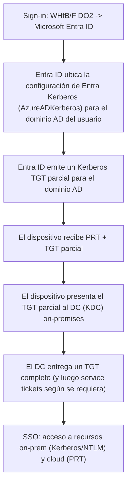

## 🚧 Post en construcción
Estoy terminando el contenido y las validaciones para documentar en este posr. Próxima actualización pronto. ✅🛠️

## Windows Hello for Business (WHfB)

Windows Hello for Business (WHfB) habilita autenticación sin contraseña (passwordless) en Windows usando PIN y/o biometría, respaldado por claves asimétricas (idealmente protegidas por **TPM**). En escenarios híbridos, WHfB puede ofrecer SSO tanto a recursos cloud (Microsoft 365, apps SAML/OIDC) como a recursos on-premises que dependan de Kerberos/NTLM, siempre que se configure el modelo adecuado de confianza.

En esta publicación del Blog se documenta la implementación de WHfB usando el modelo:

- **Cloud Kerberos Trust** (Microsoft Entra Kerberos)

Este modelo permite a Microsoft Entra ID emitir tokens de **TGT parciales** para Active Directory, que luego el cliente “intercambia” con un Domain Controller para obtener un TGT completo y acceder a recursos tradicionales on-premises.

> Nota: Este artículo usa “CONTOSO” como nombre de referencia. Ajusta nombres de grupos, políticas y dominios a tu entorno.

---

## WHfB Cloud Trust configuration (Cloud Kerberos Trust)

### Arquitectura (alto nivel)

El flujo general (simplificado) es:



## Prerrequisitos (checklist)

### Sistema y plataforma
- Windows 10 21H2, con KB5010415 o superior / Windows 11 21H2, con KB5010414 o superior en los endpoints.
- Domain Controllers Windows Server 2016+, con parches al día.
- Se recomienda que los usuarios hayan registrado por lo menos un metódo de autenticación opcional (2FA) previamente, no obstante, si el usuario no lo ha hecho se le perdira el registro durante el primer inicio de WHfB.

### Identidad híbrida
- **Microsoft Entra Connect** sincronizando (mínimo) estos atributos hacia Entra ID:
  - `onPremisesSamAccountName`
  - `onPremisesDomainName`
  - `onPremisesSecurityIdentifier`

### Roles y privilegios (mejor práctica)
- Evitar usar Global Admin para tareas operativas.
- Para la configuración de Kerberos en la nube, las siguientes son las variables que usaremos dentro de la ejecución de PowerShell para la configuración del servicio:
  - **$cloudCred**: usuario con rol **Hybrid Identity Administrator**.
  - **$domainCred**: cuenta con permisos **Domain Admin** y **Enterprise Admin** si aplica en forest y dominios múltiples.

### Alcance y exclusiones recomendadas
- Iniciar con **piloto por dispositivos** (grupo dedicado asignado a las directivas de Intune o GPO).
- Excluir cuentas privilegiadas Tier-0 (Domain Admins/Enterprise Admins) del uso de Cloud Kerberos Trust para acceso a recursos on-premises, salvo que se tenga un diseño de administración privilegiada muy controlado en donde se vaya a implementar.

---

## Paso 1 — Instalar módulo AzureADHybridAuthenticationManagement

Este módulo facilita la administración de escenarios passwordless (FIDO2/WHfB) en híbrido.

> Documentación oficial para validar cualquier cambio: [*Enable passwordless security key sign-in to on-premises resources by using Microsoft Entra ID*] (**https://learn.microsoft.com/en-us/entra/identity/authentication/howto-authentication-passwordless-security-key-on-premises#install-the-azureadhybridauthenticationmanagement-module**).

Con el siguiente comando se realiza la configuración de TLS 1.2 y se instala el módulo de AzureADHybridAuthenticationManagement.

Ejecutar PowerShell como **Administrador**:

```powershell
# Recomendado: asegurar TLS 1.2 para acceder a PowerShell Gallery
[Net.ServicePointManager]::SecurityProtocol = `
  [Net.ServicePointManager]::SecurityProtocol -bor `
  [Net.SecurityProtocolType]::Tls12

Install-Module -Name AzureADHybridAuthenticationManagement -AllowClobber
```
## Paso 2 — Crear y publicar el objeto Microsoft Entra Kerberos en AD

A continuación, se detalla el proceso de creación del objeto de tipo Computer llamado AzureADKerberos en el dominio, que tiene un comportamiento conceptualmente como un RODC (sin servidor físico asociado). Este objeto permite que Entra ID genere TGTs para el dominio On-Premises.


```powershell
# Dominio on-premises (FQDN) donde se creará el objeto Kerberos
$domain = $env:USERDNSDOMAIN

# Credenciales de Entra (rol recomendado: Hybrid Identity Administrator)
$cloudCred = Get-Credential -Message `
  'Usuario de Entra ID con permisos para configurar Hybrid Authentication (ej. Hybrid Identity Administrator).'

# Credenciales on-prem (Domain Admin; y si aplica, Enterprise Admin)
$domainCred = Get-Credential -Message `
  'Usuario de AD miembro de Domain Admins (y Enterprise Admins si aplica).'

# Crea el objeto AzureADKerberos y lo publica a Entra ID
Set-AzureADKerberosServer -Domain $domain -CloudCredential $cloudCred -DomainCredential $domainCred
```

Luego de ejecutar los comandos previamente indicados, como parte de la comprobación de la configuración debe aparecer un objeto AzureADKerberos en Active Directory Users and Computers, generalmente en Domain Controllers.

En Entra ID, la configuración queda asociada a la capacidad de emitir TGTs para los dominios configurados.

💡 Verificación: Se debe crear un objeto AzureADKerberos tipo Computer dentro del contendor de Domain Conrollers 


**⚠️ Advertencias y mejores prácticas de seguridad**
- No eliminar ni modificar el objeto AzureADKerberos mientras uses Cloud Kerberos Trust.
- No relajar la Password Replication Policy (PRP) de AzureADKerberos para permitir cuentas altamente privilegiadas. Mantén controles Tier-0 estrictos.
- Mantén patching y hardening de DCs, y monitoreo de eventos Kerberos.

## Paso 3 — Configurar WHfB para Cloud Kerberos Trust en Intune

Para que WHfB use Cloud Kerberos Trust se requieren (mínimo) estas configuraciones:

* Use Windows Hello for Business = true
* Use Cloud Trust For On Prem Auth = Enabled
* Recomendado: Require Security Device = true (usar hardware/TPM cuando aplique)

> Opción A: Settings Catalog (recomendado)

### Crea una policy en Intune (Settings catalog) y configura:

Categoría	Setting	Valor
* Windows Hello for Business	Use Windows Hello For Business	true
* Windows Hello for Business	Use Cloud Trust For On Prem Auth	Enabled
* Windows Hello for Business	Require Security Device	true

Asigna la policy a un grupo de dispositivos (piloto primero).

> Opción B: Custom policy (CSP PassportForWork)

Si prefieres OMA-URI:
```xml
OMA-URI: ./Device/Vendor/MSFT/PassportForWork/{TenantId}/Policies/UsePassportForWork
Data type: bool
Value: True

OMA-URI: ./Device/Vendor/MSFT/PassportForWork/{TenantId}/Policies/UseCloudTrustForOnPremAuth
Data type: bool
Value: True

OMA-URI: ./Device/Vendor/MSFT/PassportForWork/{TenantId}/Policies/RequireSecurityDevice
Data type: bool
Value: True
```

💡 Importante: si aplicas GPO + Intune para WHfB, normalmente GPO tiene precedencia y puede “anular” Intune. Elige una fuente principal para evitar conflictos.


## Recomendación de baseline WHfB (PIN/TPM/Biometría)

Ejemplo de configuración observada en un piloto (Intune profile):
* WHfB: Enable
* Minimum PIN length: 4
* Maximum PIN length: 8
* PIN expiration: 60 días
* PIN history: 4
* PIN recovery: Enable
* TPM: Enable
* Biometrics: Enable
* Enhanced anti-spoofing (si disponible): Enable
* Ajustes sugeridos (mejor práctica)
* Permitir PIN más largo: mantener mínimo 4–8, pero subir el máximo.
* Evitar expiración de PIN salvo requerimiento normativo: un PIN WHfB no es una contraseña reutilizable; forzar rotación puede empeorar la experiencia y no siempre mejora seguridad.
* Mantener TPM requerido y anti-spoofing habilitado cuando exista soporte.
> Considerar controles adicionales: Conditional Access, MFA fuerte para el registro inicial, y protección de endpoints (Defender for Endpoint).


## Paso 4 — Experiencia de enrolamiento (qué verá el usuario)

Después del inicio de sesión, si los prerrequisitos pasan:
Si hay biometría compatible, se ofrece configurar rostro/huella (opcional).
Se solicita confirmar uso de Windows Hello con la cuenta corporativa.
Se realiza verificación MFA (para completar el enrolamiento).
Se crea y valida el PIN (sujeto a políticas).
Se genera un par de claves asimétricas (idealmente en TPM) y se registra la pública.
El usuario puede iniciar sesión con PIN/biometría y tener SSO a cloud + on-premises.

Monitoreo y troubleshooting rápido
Validar estado en el endpoint

Ejecuta:

```powershell
dsregcmd /status
```
Revisa estado de:

Entra join / Hybrid join

PRT
Señales de SSO
Logs relevantes
Event Viewer:
Applications and Services Logs > Microsoft > Windows > User Device Registration
Busca eventos relacionados con prerequisitos y provisioning de WHfB.

