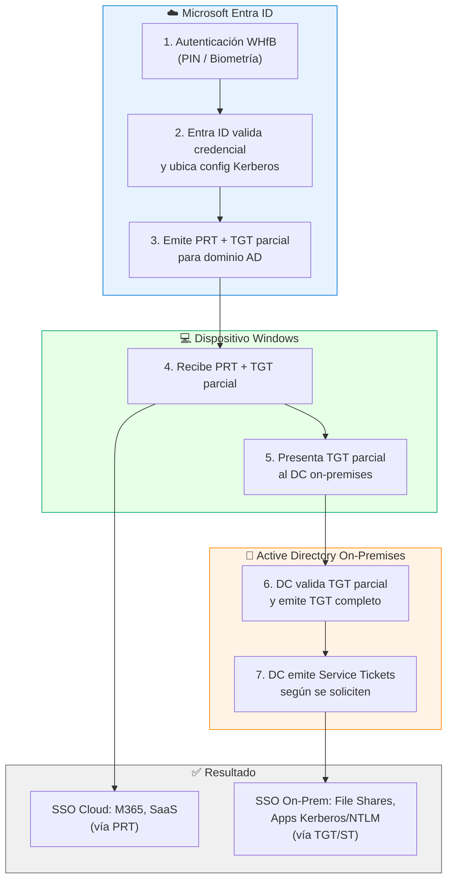

## Windows Hello for Business (WHfB)

Windows Hello for Business (WHfB) habilita autenticación sin contraseña (*passwordless*) en Windows usando **PIN y/o biometría**, respaldado por claves asimétricas protegidas idealmente por **TPM**. En escenarios híbridos, WHfB ofrece SSO tanto a recursos cloud (Microsoft 365, apps SAML/OIDC) como a recursos on-premises que dependan de Kerberos/NTLM, siempre que se configure el modelo de confianza adecuado.

En esta publicación se documenta la implementación de WHfB usando el modelo **Cloud Kerberos Trust** (Microsoft Entra Kerberos), que permite a Microsoft Entra ID emitir **TGTs parciales** para Active Directory. El cliente los intercambia con un Domain Controller para obtener un TGT completo y acceder a recursos tradicionales on-premises.

> **Nota:** Este artículo usa "CONTOSO" como nombre de referencia. Ajusta nombres de grupos, políticas y dominios a tu entorno.

---

## Arquitectura de Cloud Kerberos Trust

### Flujo de autenticación (alto nivel)




---

## Prerrequisitos

### Sistema y plataforma

- **Windows 10 21H2** con KB5010415 o superior / **Windows 11 21H2** con KB5010414 o superior en los endpoints.
- **Domain Controllers** Windows Server 2016+, con parches al día.
- Se recomienda que los usuarios hayan registrado al menos un método de autenticación adicional (MFA) previamente. Si no lo han hecho, se les pedirá durante el primer inicio de WHfB.

### Identidad híbrida

- **Microsoft Entra Connect** sincronizando (mínimo) estos atributos hacia Entra ID:
  - `onPremisesSamAccountName`
  - `onPremisesDomainName`
  - `onPremisesSecurityIdentifier`

### Requisitos de red y puertos

| Origen | Destino | Puerto | Protocolo | Propósito |
|---|---|---|---|---|
| Endpoint | DC on-prem | 88 | TCP/UDP | Kerberos authentication |
| Endpoint | DC on-prem | 464 | TCP/UDP | Kerberos password change |
| Endpoint | DC on-prem | 389 | TCP/UDP | LDAP |
| Endpoint | DC on-prem | 636 | TCP | LDAPS |
| Endpoint | `login.microsoftonline.com` | 443 | TCP | Entra ID authentication |
| Endpoint | `device.login.microsoftonline.com` | 443 | TCP | Device registration |
| Endpoint | `enterpriseregistration.windows.net` | 443 | TCP | Device enrollment |
| Entra Connect | DC on-prem | 389/636 | TCP | Sincronización de directorio |
| Entra Connect | `*.microsoftonline.com` | 443 | TCP | Sync hacia Entra ID |

### Roles y privilegios (mejor práctica)

- Evitar usar **Global Admin** para tareas operativas.
- Para la configuración de Kerberos en la nube se usan estas credenciales:
  - **`$cloudCred`**: usuario con rol **Hybrid Identity Administrator**.
  - **`$domainCred`**: cuenta con permisos **Domain Admin** (y **Enterprise Admin** si aplica en forest con múltiples dominios).

### Alcance y exclusiones recomendadas

- Iniciar con **piloto por dispositivos** (grupo dedicado asignado a las directivas de Intune).
- **Excluir** cuentas privilegiadas Tier-0 (Domain Admins / Enterprise Admins) del uso de Cloud Kerberos Trust, salvo que exista un diseño de administración privilegiada controlado.

---

## Paso 1 — Instalar módulo AzureADHybridAuthenticationManagement

Este módulo facilita la administración de escenarios passwordless (FIDO2/WHfB) en entornos híbridos.

> **Referencia oficial:** [Enable passwordless security key sign-in to on-premises resources by using Microsoft Entra ID](https://learn.microsoft.com/en-us/entra/identity/authentication/howto-authentication-passwordless-security-key-on-premises#install-the-azureadhybridauthenticationmanagement-module)

Ejecutar PowerShell como **Administrador**:

```powershell
# Asegurar TLS 1.2 para acceder a PowerShell Gallery
[Net.ServicePointManager]::SecurityProtocol = `
  [Net.ServicePointManager]::SecurityProtocol -bor `
  [Net.SecurityProtocolType]::Tls12

# Instalar módulo
Install-Module -Name AzureADHybridAuthenticationManagement -AllowClobber
```

---

## Paso 2 — Crear el objeto Microsoft Entra Kerberos en AD

Este paso crea un objeto de tipo **Computer** llamado `AzureADKerberos` en Active Directory, dentro del contenedor de Domain Controllers. Este objeto funciona conceptualmente como un RODC (sin servidor físico asociado) y permite que Entra ID genere TGTs para el dominio on-premises.

```powershell
# Dominio on-premises (FQDN) donde se creará el objeto Kerberos
$domain = $env:USERDNSDOMAIN

# Credenciales de Entra (rol recomendado: Hybrid Identity Administrator)
$cloudCred = Get-Credential -Message `
  'Usuario de Entra ID con rol Hybrid Identity Administrator.'

# Credenciales on-prem (Domain Admin; Enterprise Admin si aplica)
$domainCred = Get-Credential -Message `
  'Usuario de AD miembro de Domain Admins (y Enterprise Admins si aplica).'

# Crear el objeto AzureADKerberos y publicarlo en Entra ID
Set-AzureADKerberosServer `
  -Domain $domain `
  -CloudCredential $cloudCred `
  -DomainCredential $domainCred
```

### Verificación

Tras ejecutar el comando, se debe validar:

1. **En Active Directory:** el objeto `AzureADKerberos` de tipo Computer debe existir en el contenedor de Domain Controllers.
2. **En PowerShell:** ejecutar `Get-AzureADKerberosServer` y confirmar que `KeyVersion >= 1` y `CloudKeyVersion >= 1`.


```powershell
# Verificar estado del objeto
Get-AzureADKerberosServer `
  -Domain $env:USERDNSDOMAIN `
  -CloudCredential $cloudCred `
  -DomainCredential $domainCred

# Salida esperada (ejemplo):
# Id               : <ID>
# UserAccount      : CN=krbtgt_AzureAD,CN=Users,DC=contoso,DC=com
# ComputerAccount  : CN=AzureADKerberos,OU=Domain Controllers,DC=contoso,DC=com
# KeyVersion       : 1
# CloudKeyVersion  : 1
```

> **Advertencias de seguridad:**
> - **No eliminar ni modificar** el objeto `AzureADKerberos` mientras uses Cloud Kerberos Trust.
> - **No relajar la Password Replication Policy (PRP)** de `AzureADKerberos` para permitir cuentas privilegiadas.
> - Mantener **patching y hardening** de DCs, y monitoreo de eventos Kerberos.

---

## Paso 3 — Configurar WHfB para Cloud Kerberos Trust en Intune

### Opción A: Settings Catalog (recomendado)

Crear una policy en Intune > **Devices** > **Configuration** > **Create** > **Settings catalog**:

| Categoría | Setting | Valor |
|---|---|---|
| Windows Hello for Business | Use Windows Hello For Business | `true` |
| Windows Hello for Business | Use Cloud Trust For On Prem Auth | `Enabled` |
| Windows Hello for Business | Require Security Device | `true` |

Asignar la policy a un **grupo de dispositivos piloto** primero.

### Opción B: Custom policy (OMA-URI / CSP PassportForWork)

Si prefieres OMA-URI, crear un Configuration Profile > Custom:

```text
OMA-URI: ./Device/Vendor/MSFT/PassportForWork/{TenantId}/Policies/UsePassportForWork
Data type: bool
Value: True

OMA-URI: ./Device/Vendor/MSFT/PassportForWork/{TenantId}/Policies/UseCloudTrustForOnPremAuth
Data type: bool
Value: True

OMA-URI: ./Device/Vendor/MSFT/PassportForWork/{TenantId}/Policies/RequireSecurityDevice
Data type: bool
Value: True
```

> **Importante:** Si aplicas GPO + Intune para WHfB, normalmente GPO tiene precedencia y puede anular Intune. Elige **una sola fuente de configuración** para evitar conflictos.

### Baseline recomendada de WHfB (PIN/TPM/Biometría)

| Setting | Valor recomendado | Nota |
|---|---|---|
| WHfB | `Enable` | — |
| Minimum PIN length | `6` | Mínimo 6 para mejor seguridad |
| Maximum PIN length | `127` | No restringir innecesariamente |
| PIN expiration | `Not configured` | Un PIN WHfB no es una contraseña reutilizable; forzar rotación no mejora seguridad significativamente |
| PIN history | `4` | — |
| PIN recovery | `Enable` | Permite al usuario resetear PIN sin rehacer enrollment |
| TPM | `Required` | Obligatorio para proteger las claves |
| Biometrics | `Enable` | Si hay hardware compatible |
| Enhanced anti-spoofing | `Enable` | Si hay soporte de hardware |

> **Complementos recomendados:** Conditional Access con MFA fuerte para el registro inicial, y protección de endpoints con Defender for Endpoint.

---

## Paso 4 — Experiencia de enrollment del usuario

Después del inicio de sesión, si los prerrequisitos se cumplen, el usuario verá este flujo:

1. Se ofrece configurar biometría (rostro/huella) si hay hardware compatible.
2. Se solicita confirmar el uso de Windows Hello con la cuenta corporativa.
3. Se realiza verificación MFA para completar el enrollment.
4. Se crea y valida el PIN (sujeto a políticas configuradas).
5. Se genera un par de claves asimétricas (en TPM si está disponible) y se registra la clave pública en Entra ID.
6. El usuario puede iniciar sesión con PIN o biometría y tiene SSO a cloud + on-premises.

---

## Paso 5 — Rotación periódica de claves

Microsoft recomienda rotar la clave de cifrado del objeto `AzureADKerberos` **cada 30 días como mínimo**. La rotación no causa downtime si se ejecuta correctamente.

```powershell
# Rotar clave del objeto Kerberos
$cloudCred = Get-Credential -Message "Hybrid Identity Administrator"
$domainCred = Get-Credential -Message "Domain Admin"

Set-AzureADKerberosServer `
  -Domain $env:USERDNSDOMAIN `
  -CloudCredential $cloudCred `
  -DomainCredential $domainCred `
  -RotateServerKey

# Verificar fecha de última rotación
Get-AzureADKerberosServer `
  -Domain $env:USERDNSDOMAIN `
  -CloudCredential $cloudCred `
  -DomainCredential $domainCred
```

> **Riesgo:** Si la clave no se rota, eventualmente los TGTs parciales dejan de ser válidos para los DCs, causando fallo de SSO on-premises.

**Automatización sugerida:** Crear un Scheduled Task o Azure Automation Runbook que ejecute la rotación cada 30 días y envíe notificación al equipo de identidad.

---

## Troubleshooting y Event IDs clave

### Validación con dsregcmd

Ejecutar en el endpoint y verificar cada sección:

```powershell
# Estado completo del dispositivo
dsregcmd /status
```

Campos clave a validar:

| Campo | Valor esperado | Si falla |
|---|---|---|
| `AzureAdJoined` | `YES` | Revisar enrollment del dispositivo |
| `DomainJoined` | `YES` | Verificar que el equipo está unido al dominio AD |
| `AzureAdPrt` | `YES` | Revisar conectividad a Entra ID y estado de Hybrid Join |
| `AzureAdPrtUpdateTime` | < 4 horas | Si es antiguo, forzar refresh con `dsregcmd /forcerecovery` |
| `OnPremTgt` | `YES` | Confirma que Cloud Kerberos Trust funciona |

### Event Viewer: User Device Registration

**Ruta:** `Applications and Services Logs > Microsoft > Windows > User Device Registration > Admin`

| Event ID | Significado | Acción recomendada |
|---|---|---|
| 304 | WHfB provisioning iniciado correctamente | Informativo — flujo normal |
| 358 | Cloud Kerberos Trust: TGT parcial obtenido de Entra ID | Informativo — confirma Entra Kerberos operativo |
| 360 | TGT parcial canjeado exitosamente con DC on-premises | Informativo — SSO on-prem funciona |
| 362 | Error al obtener TGT parcial desde Entra ID | Verificar: objeto AzureADKerberos, sync de Entra Connect, DNS |
| 364 | Error al canjear TGT con DC on-premises | Verificar: DC accesible, parches KB instalados, puertos 88/464 |

### Event Viewer: AAD Operational

**Ruta:** `Applications and Services Logs > Microsoft > Windows > AAD > Operational`

| Event ID | Significado | Acción recomendada |
|---|---|---|
| 1006 | PRT obtenido exitosamente | Informativo |
| 1007 | Error al obtener PRT | Verificar estado Hybrid Join, certificados de dispositivo, conectividad |

### Validación de conectividad de red

```powershell
# Verificar resolución DNS del DC
Resolve-DnsName _ldap._tcp.dc._msdcs.contoso.com -Type SRV

# Verificar puertos Kerberos hacia DC
Test-NetConnection -ComputerName dc01.contoso.com -Port 88
Test-NetConnection -ComputerName dc01.contoso.com -Port 464

# Verificar conectividad a Entra ID
Test-NetConnection -ComputerName login.microsoftonline.com -Port 443
Test-NetConnection -ComputerName device.login.microsoftonline.com -Port 443

# Verificar tickets Kerberos existentes
klist
klist get krbtgt
```

### Problemas comunes y resolución

| Problema | Causa probable | Solución |
|---|---|---|
| `OnPremTgt: NO` en dsregcmd | Objeto AzureADKerberos no creado o clave expirada | Ejecutar `Get-AzureADKerberosServer` y rotar clave si es necesario |
| WHfB enrollment no inicia | Política no aplicada o conflicto GPO/Intune | Verificar en `mdmdiagnosticstool -out c:\temp\mdm` y revisar conflictos |
| SSO a file shares falla | DC no accesible o puertos bloqueados | Ejecutar `Test-NetConnection` a los puertos 88 y 464 |
| Event 362 repetido | Entra Connect no sincroniza atributos requeridos | Verificar sync de `onPremisesSecurityIdentifier` en Entra Connect |
| PIN creation falla con error 0x801C03ED | Dispositivo no registrado correctamente en Entra ID | Ejecutar `dsregcmd /forcerecovery` y reiniciar |
| Biometría no disponible | Hardware no compatible o driver faltante | Verificar en Device Manager y actualizar drivers |

---

## Checklist de validación post-implementación

Ejecutar después de completar todos los pasos:

- [ ] Objeto `AzureADKerberos` existe en AD (contenedor Domain Controllers)
- [ ] `Get-AzureADKerberosServer` retorna `KeyVersion >= 1` y `CloudKeyVersion >= 1`
- [ ] Entra Connect sincroniza correctamente (verificar con `Start-ADSyncSyncCycle -PolicyType Delta`)
- [ ] Política de Intune muestra status **Succeeded** para dispositivos piloto
- [ ] `dsregcmd /status` en endpoint piloto:
  - `AzureAdJoined: YES`
  - `DomainJoined: YES`
  - `AzureAdPrt: YES`
  - `OnPremTgt: YES`
- [ ] Usuario puede iniciar sesión con PIN o biometría
- [ ] SSO a recursos cloud (SharePoint, Teams) funciona sin prompt adicional
- [ ] SSO a file shares on-premises funciona sin prompt de credenciales
- [ ] SSO a aplicaciones web on-premises (IIS/Kerberos) funciona
- [ ] Event ID 358 y 360 presentes en `User Device Registration` log
- [ ] No hay Event ID 362 o 364 en los logs
- [ ] Proceso de rotación de claves documentado y programado (cada 30 días)

---

## Rollback: revertir la configuración

Si necesitas deshacer Cloud Kerberos Trust:

### 1. Remover política de Intune

Desasignar la política de WHfB del grupo de dispositivos en Intune.

### 2. Eliminar objeto AzureADKerberos

```powershell
$cloudCred = Get-Credential -Message "Hybrid Identity Administrator"
$domainCred = Get-Credential -Message "Domain Admin"

Remove-AzureADKerberosServer `
  -Domain $env:USERDNSDOMAIN `
  -CloudCredential $cloudCred `
  -DomainCredential $domainCred
```

### 3. Limpiar credenciales WHfB del endpoint (si aplica)

```powershell
# PRECAUCIÓN: elimina TODAS las credenciales WHfB del dispositivo
# Requiere reinicio
certutil -deleteHelloContainer
```

### 4. Forzar re-sincronización de Entra Connect

```powershell
Start-ADSyncSyncCycle -PolicyType Delta
```

---

## Referencias

- [Plan a Windows Hello for Business deployment](https://learn.microsoft.com/en-us/windows/security/identity-protection/hello-for-business/deploy/requirements)
- [Cloud Kerberos Trust deployment guide](https://learn.microsoft.com/en-us/windows/security/identity-protection/hello-for-business/deploy/hybrid-cloud-kerberos-trust)
- [Enable passwordless security key sign-in to on-premises resources](https://learn.microsoft.com/en-us/entra/identity/authentication/howto-authentication-passwordless-security-key-on-premises)
- [Troubleshoot Windows Hello for Business](https://learn.microsoft.com/en-us/windows/security/identity-protection/hello-for-business/hello-errors-during-pin-creation)
- [AzureADHybridAuthenticationManagement cmdlets](https://learn.microsoft.com/en-us/powershell/module/azureadhybridauthenticationmanagement)